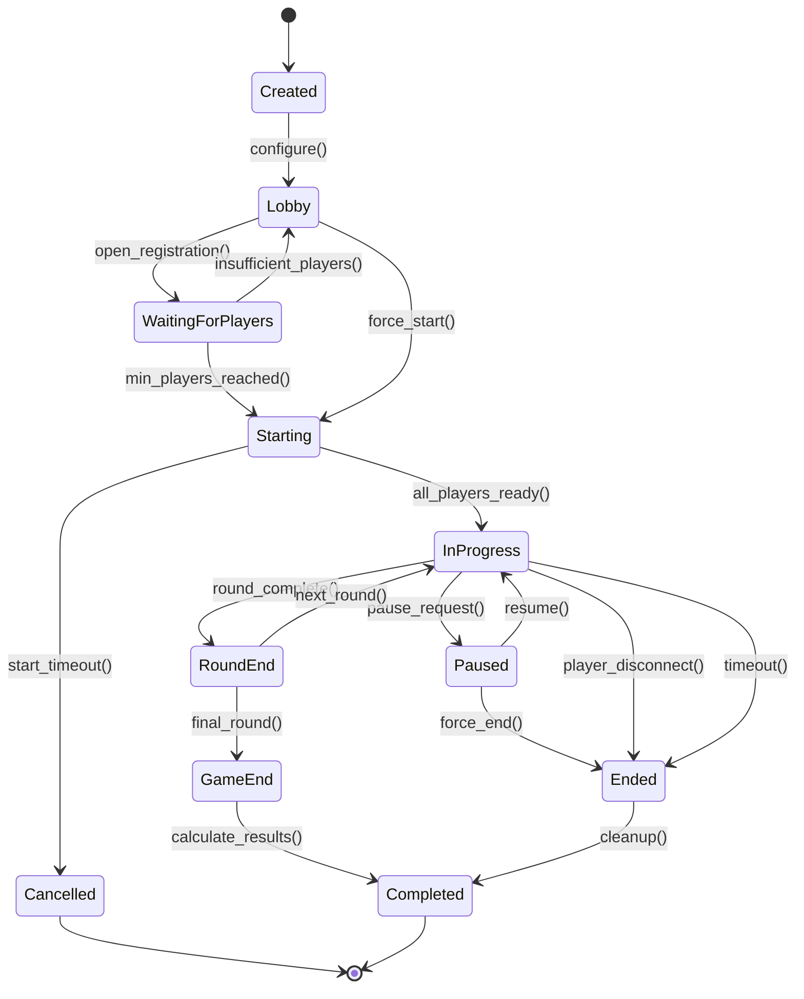
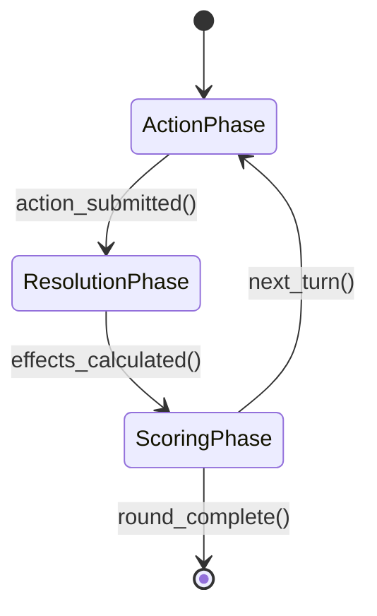

# Game State Machine Architecture

## Overview

The Game Flow system implements a finite state machine to manage game sessions through distinct phases. This architecture ensures predictable state transitions, prevents invalid operations, and maintains data consistency across multiplayer sessions.

## State Machine Diagram



## Game Phases

### 1. Created
**Initial state when game instance is instantiated**

- **Duration**: Instantaneous
- **Allowed Operations**: Configuration, setup parameters
- **Next States**: `Lobby`
- **Auto-Transitions**: Immediately to `Lobby` after configuration

```javascript
// Example state data
{
  phase: "created",
  gameId: "game_12345",
  createdAt: "2024-01-15T10:30:00Z",
  configuration: {
    gameType: "multiplayer",
    maxPlayers: 4,
    timeLimit: 300
  }
}
```

### 2. Lobby
**Pre-game phase where players can join and configure settings**

- **Duration**: Until manually started or auto-start conditions met
- **Allowed Operations**: Join, leave, configure settings, chat
- **Next States**: `WaitingForPlayers`, `Starting`
- **Minimum Requirements**: None

```javascript
// State data structure
{
  phase: "lobby",
  status: "open",
  players: [],
  maxPlayers: 4,
  gameConfiguration: {
    difficulty: "medium",
    enableChat: true,
    powerupsEnabled: false
  },
  hostId: "player_001"
}
```

**Transition Conditions:**
```javascript
// To WaitingForPlayers
if (players.length >= minPlayers && autoStart === true) {
  transitionTo("waiting_for_players");
}

// To Starting (manual)
if (hostAction === "force_start" && players.length >= 2) {
  transitionTo("starting");
}
```

### 3. WaitingForPlayers
**Automatic transition state waiting for minimum players**

- **Duration**: 30 seconds maximum
- **Allowed Operations**: Join, leave
- **Next States**: `Starting`, `Lobby`
- **Auto-Transitions**: When player count changes

```javascript
{
  phase: "waiting_for_players",
  countdown: 30,
  requiredPlayers: 2,
  currentPlayers: 1,
  autoStartTimer: "timer_abc123"
}
```

### 4. Starting
**Brief preparation phase before active gameplay**

- **Duration**: 5-10 seconds
- **Allowed Operations**: Ready status updates, last-minute configuration
- **Next States**: `InProgress`, `Cancelled`
- **Requirements**: All players must confirm ready status

```javascript
{
  phase: "starting",
  countdown: 5,
  playersReady: {
    "player_001": true,
    "player_002": false,
    "player_003": true
  },
  startTimer: "timer_def456"
}
```

### 5. InProgress
**Active gameplay phase**

- **Duration**: Variable, based on game rules
- **Allowed Operations**: Player actions, game mechanics, scoring
- **Next States**: `RoundEnd`, `Paused`, `Ended`
- **Complex Substates**: Multiple internal phases for turn-based games

```javascript
{
  phase: "in_progress",
  subPhase: "action_phase", // action_phase, resolution_phase, scoring_phase
  currentRound: 2,
  totalRounds: 5,
  turnOrder: ["player_001", "player_002", "player_003"],
  currentTurn: "player_001",
  turnTimeRemaining: 45,
  gameData: {
    // Game-specific state data
  }
}
```

**Substates for Turn-Based Games:**



### 6. RoundEnd
**Between-round transition state**

- **Duration**: 10-15 seconds
- **Allowed Operations**: Display scores, brief intermission
- **Next States**: `InProgress`, `GameEnd`
- **Purpose**: Allow players to review results and prepare for next round

```javascript
{
  phase: "round_end",
  completedRound: 2,
  roundResults: {
    "player_001": { score: 85, position: 1 },
    "player_002": { score: 72, position: 2 }
  },
  nextRoundCountdown: 10,
  isGameEnd: false
}
```

### 7. GameEnd
**Final scoring and result calculation phase**

- **Duration**: 15-30 seconds
- **Allowed Operations**: Display final results, statistics
- **Next States**: `Completed`
- **Purpose**: Show game summary and calculate final rankings

```javascript
{
  phase: "game_end",
  finalResults: {
    winner: "player_001",
    rankings: [
      { playerId: "player_001", finalScore: 285, rank: 1 },
      { playerId: "player_002", finalScore: 240, rank: 2 }
    ],
    gameStats: {
      totalRounds: 5,
      duration: "12m 34s",
      avgScorePerRound: 52.5
    }
  },
  displayTimer: 20
}
```

### 8. Paused
**Temporary suspension of active gameplay**

- **Duration**: Until resumed or force-ended
- **Allowed Operations**: Resume, configure, force end
- **Next States**: `InProgress`, `Ended`
- **Triggers**: Player request, technical issues, admin action

```javascript
{
  phase: "paused",
  pausedAt: "2024-01-15T10:45:30Z",
  pauseReason: "player_request",
  pausedBy: "player_002",
  savedGameState: {
    // Snapshot of game state when paused
  },
  pauseDuration: 120 // seconds paused so far
}
```

### 9. Ended
**Abnormal termination state**

- **Duration**: Brief cleanup period
- **Allowed Operations**: Cleanup, partial result calculation
- **Next States**: `Completed`
- **Triggers**: Disconnections, timeouts, errors

```javascript
{
  phase: "ended",
  endReason: "player_disconnect",
  endedAt: "2024-01-15T10:50:15Z",
  partialResults: {
    // Best effort results calculation
  },
  affectedPlayers: ["player_003"],
  cleanupRequired: true
}
```

### 10. Completed
**Final state - game session finished**

- **Duration**: Persistent for historical records
- **Allowed Operations**: Query results, generate reports
- **Next States**: None (terminal state)
- **Purpose**: Permanent record of game session

```javascript
{
  phase: "completed",
  completedAt: "2024-01-15T11:05:00Z",
  gameResults: {
    // Complete final results
  },
  sessionId: "session_789",
  archived: false,
  reportGenerated: true
}
```

## Transition Guards and Validations

### Player Count Validations

```javascript
class GameStateTransitions {
  canTransitionToStarting(gameState) {
    return gameState.players.length >= gameState.minPlayers &&
           gameState.players.length <= gameState.maxPlayers &&
           gameState.phase === "lobby";
  }

  canTransitionToInProgress(gameState) {
    const allPlayersReady = gameState.players.every(
      player => gameState.playersReady[player.id] === true
    );
    return gameState.phase === "starting" && allPlayersReady;
  }
}
```

### Time-Based Transitions

```javascript
class GameTimer {
  setupPhaseTimer(gameState, phase, duration) {
    return setTimeout(() => {
      switch(phase) {
        case "waiting_for_players":
          this.transitionTo("lobby");
          break;
        case "starting":
          this.transitionTo("cancelled");
          break;
        case "in_progress":
          this.handleTurnTimeout();
          break;
      }
    }, duration * 1000);
  }
}
```

## State Persistence

### Redis State Storage

```javascript
class GameStateStore {
  async saveGameState(gameId, state) {
    const stateData = {
      ...state,
      lastUpdated: new Date().toISOString(),
      version: state.version + 1
    };
    
    await redis.hset(`game:${gameId}`, {
      'state': JSON.stringify(stateData),
      'phase': state.phase,
      'lastUpdated': stateData.lastUpdated
    });
  }

  async getGameState(gameId) {
    const data = await redis.hget(`game:${gameId}`, 'state');
    return JSON.parse(data);
  }
}
```

## Event-Driven Architecture

### State Change Events

```javascript
class GameStateMachine extends EventEmitter {
  transitionTo(newPhase, data = {}) {
    const previousPhase = this.currentState.phase;
    
    // Validate transition
    if (!this.isValidTransition(previousPhase, newPhase)) {
      throw new Error(`Invalid transition from ${previousPhase} to ${newPhase}`);
    }

    // Update state
    this.currentState = {
      ...this.currentState,
      phase: newPhase,
      ...data,
      transitionedAt: new Date().toISOString()
    };

    // Emit events
    this.emit('phase_changed', {
      gameId: this.gameId,
      previousPhase,
      newPhase,
      state: this.currentState
    });

    this.emit(`entered_${newPhase}`, this.currentState);
  }
}
```

## Error Handling and Recovery

### Failed Transition Recovery

```javascript
class GameErrorHandler {
  async handleTransitionError(gameId, error) {
    const gameState = await this.stateStore.getGameState(gameId);
    
    switch(error.type) {
      case "PLAYER_DISCONNECT":
        if (gameState.phase === "in_progress") {
          await this.pauseGame(gameId, "connection_issue");
        }
        break;
        
      case "TIMEOUT":
        await this.transitionTo("ended", {
          endReason: "timeout",
          partialResults: this.calculatePartialResults(gameState)
        });
        break;
        
      case "INVALID_STATE":
        await this.rollbackToLastValidState(gameId);
        break;
    }
  }
}
```

This state machine architecture ensures reliable, predictable game flow management while providing flexibility for different game types and scenarios.